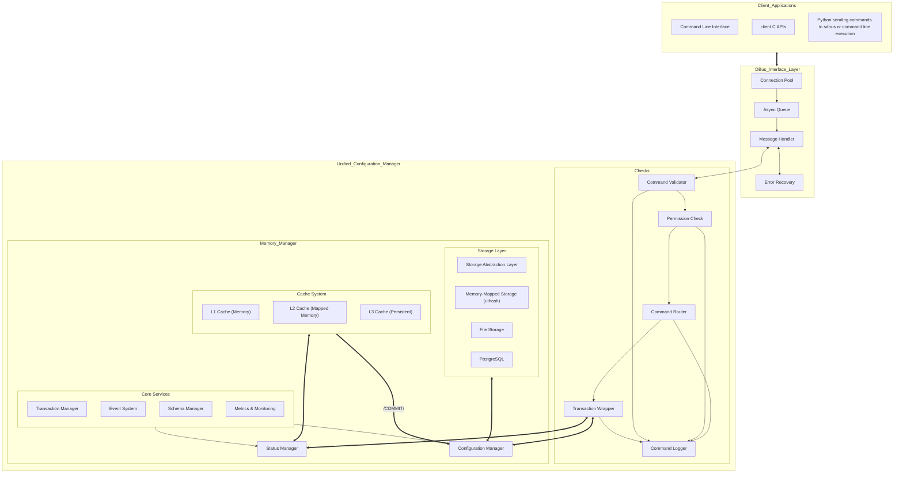
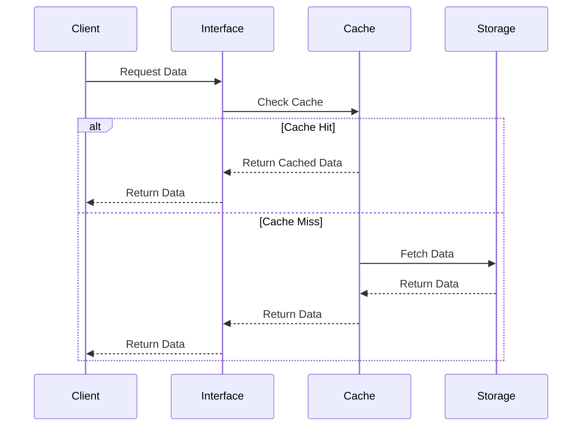
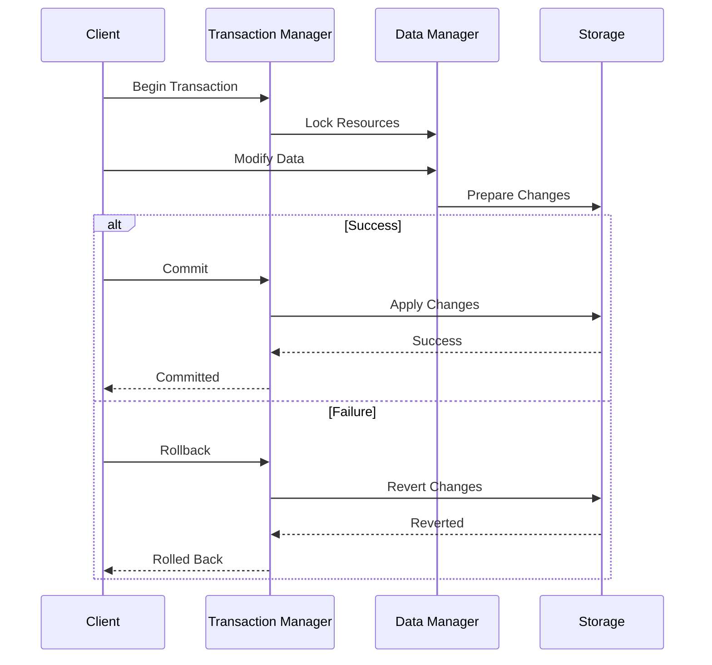
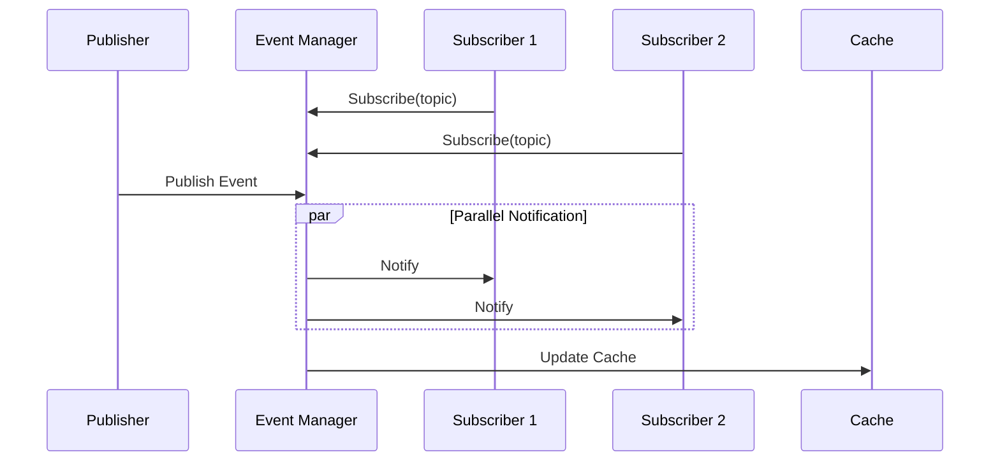
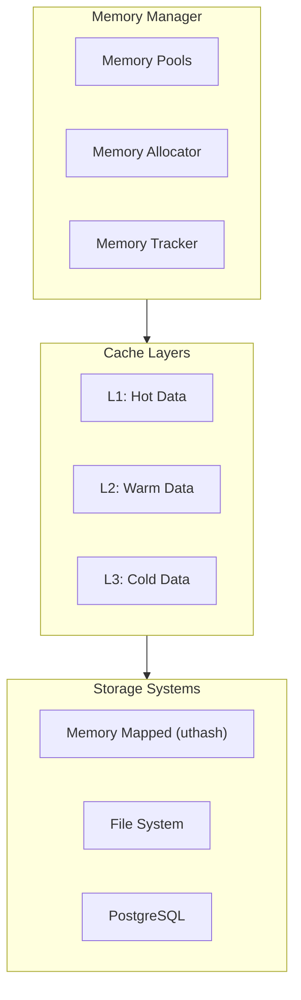
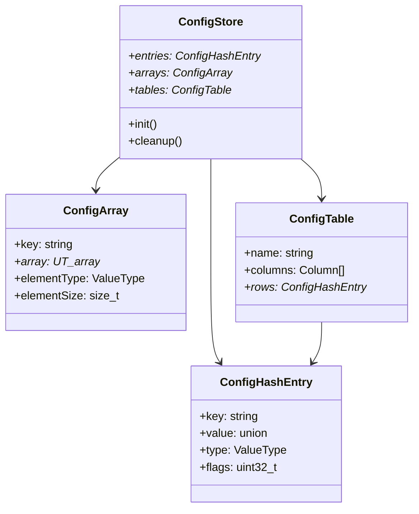
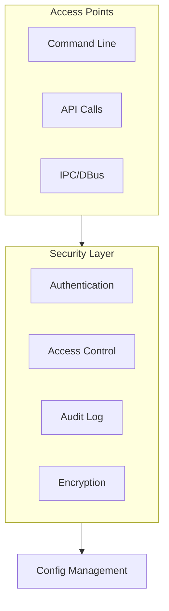

# High Level Design - Configuration Management System

## System Architecture

## Component Flow Diagrams

### Data Access Flow

### Transaction Flow

### Event System Flow

## Memory Management Architecture

## Data Structure Organization

## Security Architecture

